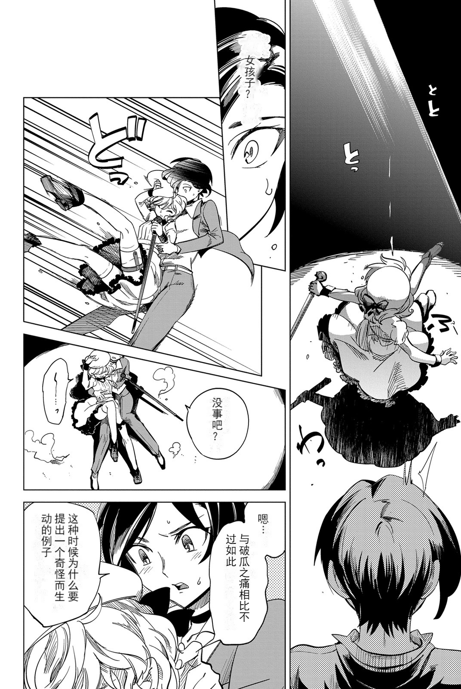

## 简介

本项目旨在构建一个兼容 MangaEditor API 的本地漫画翻译应用。

## 使用

在 [release](https://github.com/otokoneko/MangaSharp/releases) 页面下载应用以及需要的模型压缩包，全部解压后编辑 `appsettings.json` 文件，配置好模型路径以及翻译接口即可。

`model.quant` 模型为经过量化剪裁处理的模型，在部分较新的 CPU 以及 GPU 上的性能可能会高于 `model` 模型，但精度可能有所下降。

## 示例

 

## API实现进度

- mangaEditor/upload
  - 完全实现
- mangaEditor/translate
  - 已实现日文至中文的文字识别与翻译
  - 未实现韩文、英文的文字识别与翻译
- mangaEditor/translateAll
  - 未实现

## 关联项目

- [mangaEditor-frontend](https://github.com/ljsabc/mangaEditor-frontend)
- [Manga-Text-Segmentation](https://github.com/juvian/Manga-Text-Segmentation)
  - 本项目使用的文字识别模型是基于该项目的模型经过 onnx 导出与量化后得到的
- [dbscan](https://github.com/wangyiqiu/dbscan)
  - 本项目使用的 `DbscanAlgorithm.dll` 是基于该项目构造的
